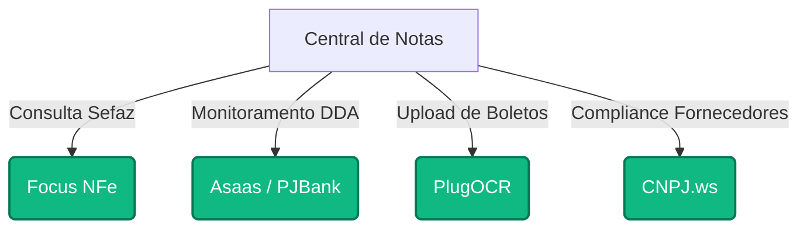

# 🚀 Roadmap de Integração de APIs: Central de Notas

Este documento serve como um guia estratégico e técnico para plugar APIs reais no sistema **Central de Notas**. O foco principal desta curadoria é a **autonomia ("Zero-T.I.")**, priorizando provedores modernos que nós dois (eu, como IA, e você) conseguimos integrar sozinhos através de chamadas REST em JavaScript, sem dependência do setor de Tecnologia da Informação ou infraestruturas complexas de servidores locais.

---

## 🎯 Estratégia de Independência de T.I.

Integrações tradicionais de ERP e Sefaz costumam exigir servidores de arquivos localizados dentro da empresa, VPNs dedicadas e configurações complexas de rede. 
Para contornar isso e acelerar a entrega do sistema pronto, selecionamos **APIs baseadas inteiramente na Nuvem (Cloud Native)** que oferecem:
1. **Autenticação Simples:** Uso de chaves de API (`Bearer Token` ou `api-key`) que configuramos diretamente em variáveis de ambiente (`.env`).
2. **Ambiente de Sandbox (Testes) Imediato:** Cadastro automático no painel do fornecedor para gerarmos chaves de teste em 5 minutos.
3. **Webhooks Prontos:** O próprio provedor envia as atualizações de Notas Fiscais ou Boletos DDA para o nosso backend (Supabase Database Webhooks) sem que precisemos fazer consultas repetitivas (polling).

---

## 🔍 Mapeamento e Comparação de Fornecedores

### 1. Sefaz & Consulta de Notas Fiscais Eletrônicas (NFe)
Para buscar todas as notas emitidas contra os CNPJs das suas obras diretamente da Secretaria da Fazenda (Sefaz), precisamos de um gateway que faça a consulta automática usando o Certificado Digital (A1) da empresa.

| Provedor | Custo Médio | Complexidade de Instalação | Dependência de T.I. | Autonomia / Benefícios |
| :--- | :--- | :--- | :--- | :--- |
| **Focus NFe** *(Recomendado)* | R$ 190 a R$ 490/mês | **Muito Baixa** | **Nula** | Excelente documentação. Sandbox liberado instantaneamente. Permite consultar notas recebidas e fazer manifesto com chamadas simples de `fetch`. |
| **PlugNotas (TecnoSpeed)** | R$ 250 a R$ 600/mês | **Baixa** | **Nula** | Interface visual excelente no portal do parceiro. Altamente resiliente a instabilidades da Sefaz. |
| **Arquivei API** | Sob consulta (corporativo) | **Média** | **Média** | Muito focado em grandes corporações. Processo comercial demorado e burocrático, necessitando de aprovações. |

> [!TIP]
> **Recomendação:** A **Focus NFe** é a melhor escolha para este momento da empresa. Conseguimos criar uma conta gratuita de testes, carregar um certificado digital simulado e começar a consumir dados em minutos.

---

### 2. DDA (Débito Direto Autorizado) & Banco Central
O DDA permite buscar todos os boletos registrados que foram emitidos contra o CNPJ da empresa. Isso evita fraudes e elimina a necessidade de digitação ou leitura manual de boletos.

| Provedor | Custo Médio | Complexidade de Instalação | Dependência de T.I. | Autonomia / Benefícios |
| :--- | :--- | :--- | :--- | :--- |
| **Asaas API / Gateways** *(Recomendado)* | R$ 0,99 por boleto liquidado | **Muito Baixa** | **Nula** | Permite ler o DDA da empresa de forma automatizada se usarmos a conta digital deles. Integração 100% via API HTTPS padrão. |
| **PJBank** | Sob consulta | **Baixa** | **Nula** | Focado em integrar sistemas ERP a bancos tradicionais sem burocracia bancária convencional. |
| **APIs Diretas de Bancos (BB / Itaú)** | Geralmente gratuito | **Altíssima** | **Máxima** | Exige aprovação do gerente de contas do banco, assinatura de contratos corporativos, configuração de certificados mTLS (SSL mútuo) e validações rígidas de segurança corporativa pela T.I. |

> [!IMPORTANT]
> **Aviso sobre APIs Bancárias:** Evite a integração direta com as APIs oficiais do Banco do Brasil ou Itaú para a homologação inicial. O processo burocrático de liberação de credenciais de produção no banco pode levar de 30 a 90 dias e exige aprovações da T.I. Central. **Substitutos como Asaas ou PJBank dão a mesma experiência visual e técnica e liberam as chaves na hora.**

---

### 3. Leitura de Boletos e OCR (Extração de PDFs)
Quando o boleto ou a nota fiscal de serviço (NFSe municipal) chega por e-mail em formato PDF, o sistema precisa ler o arquivo e extrair a linha digitável, vencimento e valor sem intervenção humana.

| Provedor | Custo Médio | Complexidade de Instalação | Dependência de T.I. | Autonomia / Benefícios |
| :--- | :--- | :--- | :--- | :--- |
| **PlugOCR (TecnoSpeed)** *(Recomendado)* | R$ 0,10 a R$ 0,25 por documento | **Muito Baixa** | **Nula** | Modelo pré-treinado especificamente para boletos e notas fiscais do mercado brasileiro. Retorna um JSON estruturado com valor, vencimento e CNPJ emissor de forma precisa. |
| **Google Cloud Document AI** | U$ 0.05 por página | **Média** | **Baixa** | Altíssima precisão de OCR, porém requer treinamento de modelos para extrair campos personalizados de boletos brasileiros (exige configuração no painel do GCP). |
| **Tesseract OCR (Open Source)** | Gratuito | **Alta** | **Alta** | Requer instalação de pacotes no servidor da aplicação. A taxa de acerto para tabelas e layouts de boletos sem inteligência artificial é baixa. |

---

### 4. Consultas Cadastrais (CNPJ & Protestos)
Verificar a situação cadastral do fornecedor na Receita Federal e se há pendências ou protestos ativos que possam embargar a obra.

| Provedor | Custo Médio | Complexidade de Instalação | Dependência de T.I. | Autonomia / Benefícios |
| :--- | :--- | :--- | :--- | :--- |
| **CNPJ.ws** *(Recomendado)* | Grátis (plano básico) a R$ 49/mês | **Muito Baixa** | **Nula** | Retorna o cadastro completo do CNPJ na hora (Razão Social, CNAE, Capital Social, Sócios). Ativação de plano em 1 minuto. |
| **Serasa Experian API** | Sob consulta | **Alta** | **Média** | Líder de mercado em dados de crédito e protesto. Porém, a negociação comercial é complexa e exige faturamento mínimo elevado para liberar APIs REST de consulta. |

---

## 📊 Matriz de Decisão para a Apresentação Comercial

Para a sua negociação com a diretoria, use os seguintes pontos para demonstrar que o projeto está pronto para ir ao ar de forma ágil e barata:



### Argumentos de Impacto Comercial:
1. **Redução drástica de tempo de implantação:** Em vez de um projeto de 6 meses liderado pela T.I., conseguimos conectar o sistema em **2 semanas** usando esses parceiros de nuvem.
2. **Custo operacional sob demanda:** O custo inicial com as APIs recomendadas é menor que **R$ 300,00 por mês** somados, escalando apenas à medida que o volume de obras e notas fiscais aumentar.
3. **Segurança total contra fraudes:** Com o DDA integrado via Asaas/PJBank, o financeiro só paga boletos validados contra as notas fiscais correspondentes da Focus NFe.

---

## 🛠️ Passo a Passo para Conectar e Testar (Sem Custo)

Caso queira começar a testar credenciais reais agora com o sistema, siga este roteiro rápido:

### Passo 1: Cadastro na Focus NFe (Consultas Sefaz)
1. Acesse o site do [Focus NFe Sandbox](https://focusnfe.com.br) e crie uma conta gratuita.
2. No painel, copie o seu `Token de Produção/Homologação`.
3. Adicione no arquivo `.env` do projeto:
   ```env
   VITE_FOCUSNFE_TOKEN="seu_token_aqui"
   ```
4. A partir desse momento, as consultas de notas fiscais reais podem ser disparadas chamando:
   ```javascript
   fetch('https://homologacao.focusnfe.com.br/v2/nfe?cnpj=SEU_CNPJ', {
     headers: { 'Authorization': 'Basic ' + btoa(VITE_FOCUSNFE_TOKEN + ':') }
   });
   ```

### Passo 2: Cadastro no CNPJ.ws (Dados Cadastrais)
1. Acesse [CNPJ.ws](https://cnpj.ws/) e copie a chave pública gratuita de testes.
2. Use-a diretamente para consultar dados dos fornecedores das suas obras:
   ```javascript
   fetch('https://publica.cnpj.ws/cnpj/12345678000199')
     .then(res => res.json())
     .then(dados => console.log(dados.razao_social));
   ```

Com essa estrutura montada, você tem em mãos um robusto plano técnico e financeiro para blindar e valorizar o projeto na reunião com os diretores!
